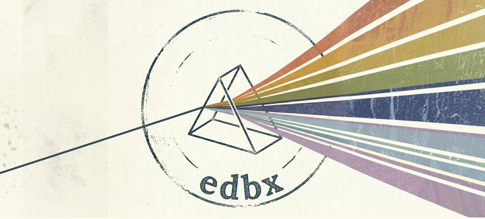

# Ethical Design Package

**A skillset and agent that bring ethical design methods into the product workflow — at the moment a decision is being made.**

---

## What this is

A set of **21 ethical design skills** — each one a structured AI prompt encoding an established design ethics method — plus an **Ethical Design Specialist agent** that orchestrates them. Together they make rigorous ethical analysis available inside the tools and workflows designers and product managers already use.

Every skill produces a concrete artifact: a stakeholder map, a dark-pattern audit with named statutes, a behavioral forecast with cascade analysis, a signed ethical contract with thresholds and named owners. The artifact arrives in the room before the decision is finalized.

---

## Why a skillset and agent

Ethical design as a discipline is rich, well-researched, and has produced excellent methods over the past two decades. What's harder is **access** — the same way many people who would benefit from medical or educational expertise can't always reach it on demand.

That's where AI helps. LLMs don't replace specialists. They lower the activation cost of getting structured, expert-informed thinking into a moment when it's needed. A patient who can't reach a doctor at 2 a.m. is better served by a careful AI conversation than by no conversation. A student without a tutor learns more with a thoughtful AI than without one. And a product team that can't add a full-time ethical-design specialist can still bring 21 research-based methods into a sprint review with a single prompt.

This package is built on that premise. The skills don't replace ethical design expertise — they integrate it, so that ethical thinking happens *as part of* shipping rather than after.

---

## What's in the box

### 21 ethical design skills

Each skill is a `SKILL.md` file with a complete methodology, output format, and quality bar. Skills cover four kinds of work:

**Audit existing design** — DAH Cards, Bad Design Canvas, Fair Patterns, Humane Design Guide, Digital Ethics Compass, Responsible Design Prism, CIDER, Ethicography

**Forecast what design will do** — Inverted Behavior Model, Motivation Matrix, Worrystorming, Black Mirror Brainstorming, Anti-Heroes, STF-ET

**Get the team aligned** — Value Dams and Flows, Values Levers, Ethical Contract, Pledge Works, DAH Cards (manifesto mode)

**Decide and research** — Normative Design Scheme, Critical Interviewing, Another Lens

The methods come from researchers and practitioners — Brignull's dark patterns work, Fogg's behavior model, Carspecken's critical interviewing framework, Center for Humane Technology's six sensitivities, the Digital Ethics Compass framework, Stanford's STF-ET tool chain, and others. Each `SKILL.md` cites its source.

### Ethical Design Specialist agent

[`AGENT.md`](AGENT.md) defines an orchestrator that:

- Listens to the user's actual situation and routes to the right method(s)
- Recognizes 5 chaining patterns (audit → commitment, worry → contract, lens → spec, forecast → redesign, decision deadlock → three-lens)
- Knows when to push back — refuses to produce ethics-washing or ratify decisions already made
- Cites sources, never invents methodology elements not in the underlying SKILL.md

### Tutorials

[`tutorials/`](tutorials/) contains plain-language guides to each method — for designers and PMs who want to understand what each method does without studying the academic source.

---

## Validation

The skills were evaluated against a strong baseline (a competent LLM told the method's name and asked to apply it thoroughly) using two independent judge models. Headline results: **17 / 21 skills win cleanly under both judges, 4 are razor-thin under Gemini, 0 lose under both.**

Full per-skill scoreboard, methodology, reflection on what worked, and proposed improvements: **[RESULTS.md](RESULTS.md)**.

### Conformance testing

Beating a baseline doesn't show that a skill does what its own quality bar promises. So each skill's **Deliverable Quality Bar** is being turned into a machine-checkable rubric (`conformance.json` beside the `SKILL.md`), and each skill is run many times against it. Counts, coverage and required sections are checked in code; judgments that need reading are scored by [TypeSafe Jev](https://docs.typesafe.ai/introduction), calibrated against hand-labelled examples before any score is trusted.

Eleven skills are covered so far. The checks found real defects in the skills themselves, and every fix was measured before and after (18–36 runs each side, Fisher exact test):

| Skill | Defect found | Before → after |
|---|---|---|
| Anti-Heroes | Card deck lived only in a reference file, so the model invented cards | real deck cards: 2/18 → 17/18 runs |
| DAH Cards | Microcopy rewrite sat in a mode that audits skip | rewrite present: 13/24 → 24/24 |
| CIDER | Commitment template had no deadline or owner | accountable commitment: 28/36 → 36/36 |
| Humane Design Guide | Example heuristics got pasted into audits of other products | product-specific heuristics: 5/18 → 18/18 |
| Ethicography | Output format had no slot for affected populations | decisions with named populations: 23% → 84% |

Each of these is significant at p ≤ 0.05. Smaller clarifications (Pledge Works, STF-ET, Fair Patterns, Another Lens) showed no regressions but no significant gain, and Inverted Behavior Model needed no change. One more finding: without the skill, a capable model invented what the CIDER acronym stands for in two of three runs.

Outputs are generated with DeepSeek V4 Pro. These results measure whether a skill follows its own method, not whether the method produces insight a practitioner would trust — that still needs human evaluators. If you use these methods, [open an issue](https://github.com/abektes/edbx-designskills/issues) and report back; negative results are as useful as positive ones.

To check the skills yourself:

```bash
python3 scripts/validate_skills.py                                  # frontmatter, links, house style
python3 scripts/run_generation.py --skills cider --reps 6 --arm with_skill   # needs OPENROUTER_API_KEY
python3 scripts/conformance.py --skills cider --reps 6 --dry-run    # structural checks only; drop --dry-run to add Jev (TYPESAFE_API_KEY)
```

Keys are read from `eval-framework/.env` (gitignored), which is also where generated outputs and scores are cached.

---

## How to use it

### Quickest path — through the agent

Open your AI assistant (Claude Code, Claude.ai, Cursor, or any tool that loads project context), point it at this repo, and describe your situation. The [`AGENT.md`](AGENT.md) file routes you to the right method.

### Direct path — pick a skill

Browse the [`tutorials/`](tutorials/) directory or the skill list below, choose a method, and load that skill's `SKILL.md` into your AI agent as a system prompt.

### Understanding a skill before using it

Read the corresponding tutorial file in [`tutorials/`](tutorials/). Each tutorial covers what the method does, when to reach for it, what it produces, the key insight, and a worked example.

---

## Skill index

| Skill | What it does |
|---|---|
| [`edbx-anotherlens`](edbx/edbx-anotherlens/) | Surfaces designer bias and converts insight to a Design Decision Spec |
| [`edbx-anti-heroes`](edbx/edbx-anti-heroes/) | Names manipulative design moves with a card deck (Trap-Setter, Camouflager, …) and pairs each with a Hero counter-move |
| [`edbx-bad-design-canvas`](edbx/edbx-bad-design-canvas/) | 12-category adversarial audit of a product's potential harms |
| [`edbx-black-mirror-brainstorming`](edbx/edbx-black-mirror-brainstorming/) | Forecasts dystopian misuse scenarios to surface non-obvious risks |
| [`edbx-cider`](edbx/edbx-cider/) | Audits exclusionary assumptions embedded in a design |
| [`edbx-critical-interviewing`](edbx/edbx-critical-interviewing/) | Research protocol with non-obvious harms inventory and interview guardrails |
| [`edbx-dah-cards`](edbx/edbx-dah-cards/) | DAH (Design Against Humanity) Cards session — six harm categories with manifesto option |
| [`edbx-digital-ethics-compass`](edbx/edbx-digital-ethics-compass/) | Four-category audit (data, manipulation, transparency, automation) with stakeholder map and objective-function risk table |
| [`edbx-ethical-contract`](edbx/edbx-ethical-contract/) | Cross-disciplinary signed commitment with bias audit and red lines |
| [`edbx-ethicography`](edbx/edbx-ethicography/) | Analyzes team decisions over time for ethical trajectory and 12-month forecast |
| [`edbx-fair-patterns`](edbx/edbx-fair-patterns/) | Dark pattern audit with jurisdiction-specific statutes and vulnerable-population matrix |
| [`edbx-humane-design-guide`](edbx/edbx-humane-design-guide/) | Six-sensitivity audit with named mechanisms and exploitation-stack analysis |
| [`edbx-inverted-behavior-model`](edbx/edbx-inverted-behavior-model/) | Behavior forecast with worst-possible-design, convergence check, and 5-stage cascade |
| [`edbx-motivation-matrix`](edbx/edbx-motivation-matrix/) | Maps the five human drives a product activates and whether ethically |
| [`edbx-normative-design-scheme`](edbx/edbx-normative-design-scheme/) | Three-lens decision support with Universal Law Test and Triad Conflict Matrix |
| [`edbx-pledge-works`](edbx/edbx-pledge-works/) | 5-part operationalized pledges with "what we refuse to build" register |
| [`edbx-responsible-design-prism`](edbx/edbx-responsible-design-prism/) | Five-axis ethical posture rating with stakeholder map and mechanism audit |
| [`edbx-stf-et`](edbx/edbx-stf-et/) | Stanford's 5-tool chain for long-term ethical futures |
| [`edbx-value-dams-and-flows`](edbx/edbx-value-dams-and-flows/) | Maps stakeholder value conflicts with power analysis |
| [`edbx-values-levers`](edbx/edbx-values-levers/) | Identifies levers given the user's role to shift culture toward ethical design |
| [`edbx-worrystorming`](edbx/edbx-worrystorming/) | Structured worry session that reframes concerns as design values |

---

## Repository layout


The top row is how a product team uses a method; the bottom row is the evaluation harness that checks each skill. The diagram is generated from [`docs/diagrams/edbx.architecture.json`](docs/diagrams/edbx.architecture.json) with [Archify](https://github.com/tt-a1i/archify).

```
.
├── AGENT.md                       — Ethical Design Specialist agent definition
├── README.md                      — this file
├── RESULTS.md                     — validation scoreboard and methodology
├── LICENSE                        — MIT
├── edbx/                          — 21 structured ethical-design methods
│   └── edbx-*/                    — one folder per skill
│       ├── SKILL.md               — methodology + AI agent instructions
│       ├── conformance.json       — quality bar as machine-checkable rubric
│       └── evals/evals.json       — three test scenarios per skill
├── scripts/                       — validator, generation harness, conformance scoring, blind review pack
├── tutorials/                     — plain-language guide to each skill
├── docs/diagrams/                 — architecture diagram and its source spec
└── assets/                        — images and banner
```

---

## Who this is for

- **Designers and product managers** who want rigorous ethical analysis available at decision time, without having to become ethical-design experts themselves
- **Design consultants and researchers** who want to bring structured methods into engagements that don't have an in-house ethical-design specialist
- **Educators and students** in design, HCI, and product management who want a working toolkit for studying these methods in practice
- **Tool builders** who want to see how established design ethics research can be operationalized as AI agent skills

---

## Contributing

This is an open exploration. If you know of methods that should be here, see ways the existing skills could be stronger, or want to extend the agent's routing logic, issues and pull requests are welcome.

If you spot a mistake or have an idea, you can also reach me on [LinkedIn](https://www.linkedin.com/in/ahmetbektes/), [X](https://x.com/Abektes), or open an issue here.

---

## Acknowledgements

Every method in this package is built on the work of researchers and practitioners who developed the underlying frameworks — including Harry Brignull, Colin M. Gray, BJ Fogg, Phil Francis Carspecken, the Center for Humane Technology, the Danish Design Center (Digital Ethics Compass), the McCoy Family Center for Ethics in Society at Stanford (Ethics Toolkit), and many others. The contribution of this package is integration: bringing those methods together as AI-runnable skills that show up at the moment of decision.

---

## Support

If you find this package useful, you can support the work:

<a href="https://www.buymeacoffee.com/abektes" target="_blank"></a>
